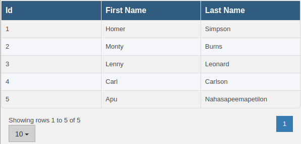
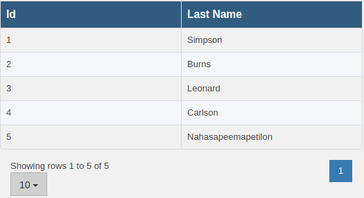
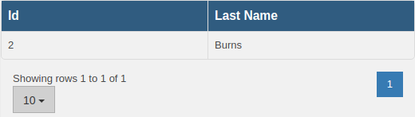
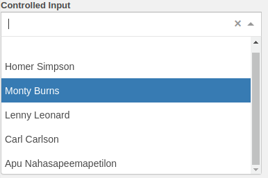

<a name="top"/>
# Components

* [Introduction](README.md#top)
  * [How It Works](README.md#intro)
  * [Development](README.md#development)
  * [Building for Production](README.md#build)
  * [Running Tests](README.md#test)
  * [Additional Commands](README.md#more)
* [Components](COMPONENTS.md#top)
  * [Higher Order Components](COMPONENTS.md#hocs)
    * [withToken](COMPONENTS.md#withtoken)
    * [withData](COMPONENTS.md#withdata)
    * [withDataTransform](COMPONENTS.md#withdatatransform)
    * [withDataFilter](COMPONENTS.md#withdatafilter)
  * [Base Components](COMPONENTS.md#basecomponents)
    * [Header](COMPONENTS.md#header)
    * [Footer](COMPONENTS.md#footer)
    * [BaseTable](COMPONENTS.md#basetable)
    * [DataTable](COMPONENTS.md#datatable)
      * [route](COMPONENTS.md#datatable-route)
      * [transform](COMPONENTS.md#datatable-transform)
      * [filter](COMPONENTS.md#datatable-filter)
    * [Input](COMPONENTS.md#input)
      * [Text](COMPONENTS.md#input-text)
      * [Checkbox](COMPONENTS.md#input-checkbox)
      * [Select](COMPONENTS.md#input-select)
      * [DataSelect](COMPONENTS.md#input-dataselect)
    * [SearchBar](COMPONENTS.md#searchbar)

<a name="hocs"/>
## Higher Order Components (HOC's)

<a name="withtoken"/>
#### withToken
Provides the wrapped component with an access token for use in web requests requiring authentication.

```javascript
import withToken from './datafetching/Token'

function MyComponent(props) {
    // the token is passed from the state of the withToken HOC
    const { token } = props
    if (!token) {
        return <div>Waiting for token...</div>
    }
    return <div>Token is {token}</div>
}

export default withToken(MyComponent)
```

The HOC requests a token from a TokenSingleton in the Token module. The TokenSingleton holds a single token and is responsible for making the web request to actually grab a token from the express server.

On initial load it is highly likely the token will be null (as rendering is most likely quicker than a fetch to the express server) so components must check for null tokens.

<a name="withdata"/>
#### withData

Loads data from the server, requires a token for authentication as well as a route to load data from

```javascript
import withData from './datafetching/DataLoader'

function MyComponent(props) {
    const { data, loading, error } = props
    if (loading) {
        return <div>loading data...</div>
    }
    if (error) {
        return <div>Oops something went wrong! {error}</div>
    }
    return <div>Loaded data: {data}</div>
}

export default withData(MyComponent)

...

// or since the withData component needs a token we can wrap it as well
export default withToken(withData(MyComponent))
```

Once wrapped we can use the component as below

```javascript
import MyComponent from './MyComponent'

const DATA_ROUTE = 'route/to/data'


function MyOuterComponent(props) {
    return <MyComponent route={DATA_ROUTE} />
}

export default MyOuterComponent
```


<a name="withdatatransform"/>
#### withDataTransform

Simple component that takes transform and data argument and applies the transform to the data

```javascript
export default function withDataTransform(Wrapped) {
  function WithDataTransformHOC(props) {
    const { data, transform, ...otherProps } = props
    const transformed = transform(data)
    return <Wrapped data={transformed} {...otherProps} />
  }
}
```
Useful for transforming the results of the withData component and passing it through to the wrapped component.

Eg. A table expects an array of data, but hitting the endpoint `/mines` returns the object `{ mines: [...] }`. Using withDataTransform we can pass a function `{ data => return data.mines }` as the transform to convert the input to something the table can understand.


<a name="withdatafilter"/>
#### withDataFilter

Expects data to be an array of objects object to filter against which can be dynamically updated. Each object in the data array is compared against the filter object. The resulting data array contains only objects who match the filter objects values. Useful for reducing data (ie. searching a table) with a filter that can dynamically update.


<a name="basecomponents"/>
## Base Components

<a name="header"/>
#### Header

Renders a bcgov header component

```javascript
const propTypes = {
  title: PropTypes.string, // title to display
  children: PropTypes.arrayOf(PropTypes.any), // any links to render in the header
}

const defaultProps = {
  title: '',
  children: [],
}
```

```javascript
import Header from './header'

function MyPage() {
  return (
    <Header title="My Page">
      <a href="/">Home</a>
      <a href="/away">Away</a>
      <a href="/farther">Mars</a>
    </Header>
  )
}

export default MyPage
```


<a name="footer"/>
#### Footer

Bcgov footer component. Contains a set of default footer links. Can be passed and optional items prop to append items to those displayed by default.

```javascript
import Footer from './footer'

function MyPage() {
  const items = [
    { name: 'good', href: '/good' },
    { name: 'better', href: '/better' },
  ]

  return (
    <div style={{ height: '100%' }}>
      <div style={{ height: '100%' }}>Page</div>
      <Footer items={items} />
    </div>)
}

export default MyPage
```


<a name="basetable"/>
#### BaseTable

Renders a table based on a data array prop. Uses react-bootstrap-table (http://allenfang.github.io/react-bootstrap-table/) under the hoods

```javascript
const propTypes = {
  data: PropTypes.arrayOf(PropTypes.object), // array of objects to render. each object becomes a table row
  keyField: PropTypes.string, // identifier value in each object
  columnLabels: PropTypes.object, // optional map of object keys => column labels (eg. data = [{a: 1, b:false},...], columnLabels = { a: 'Count', b: 'Enabled' })
  onRowClick: PropTypes.func, // callback to execute on row click
  expandComponent: PropTypes.func, // component to render when row is expanded (if undefined rows do not expand)
  searchComponent: PropTypes.func, // component to render for search bar
  updateFilter: PropTypes.func, // callback passed to searchComponent as the onFilter prop
  updateData: PropTypes.func, // callback passed to the expandComponent as the updateTableData prop
}

const defaultProps = {
  data: null,
  keyField: 'id',
  columnLabels: {},
  onRowClick: undefined,
  expandComponent: undefined,
  searchComponent: undefined,
  updateFilter: undefined,
  updateData: undefined,
}
```

The simplest table only requires the data prop.  It inspects the first object in the data prop to create columns

```javascript
import BaseTable from './table/BaseTable'

const TABLE_DATA = [
  { id: 1, firstName: 'Homer', lastName: 'Simpson' },
  { id: 2, firstName: 'Monty', lastName: 'Burns' },
  { id: 3, firstName: 'Lenny', lastName: 'Leonard' },
  { id: 4, firstName: 'Carl', lastName: 'Carlson' },
  { id: 5, firstName: 'Apu', lastName: 'Nahasapeemapetilon' },
]

function MyTable() {
  return <BaseTable data={TABLE_DATA} />
}

export default MyTable
```


<a name="datatable"/>
#### DataTable

BaseTable wrapped for loading data from an API endpoint, transforming data, and filtering, data

```javascript
import BaseTable from './table/BaseTable'
import withData from '../datafetching/DataLoader'
import withDataTransform from '../datatransform'
import withDataFilter from '../datafilter'
import withToken from '../datafetching/Token'

function DataTable(props) {
  const {
    loading,
    data,
    error,
    ...otherProps
  } = props

  if (loading) {
    return <div className="text-center">Loading...</div>
  } else if (error) {
    return <div className="text-center">Error Fetching Data</div>
  }

  return <BaseTable data={data} {...otherProps} />
}

export default withToken(withData(withDataFilter(withDataTransform(DataTable))))
```

<a name="datatable-route"/>
##### route

If we had an API endpoint like localhost:3000/simpsons we could construct a DataTable as follows

```javascript
// localhost:3000/simpsons
[
  { id: 1, firstName: 'Homer', lastName: 'Simpson' },
  { id: 2, firstName: 'Monty', lastName: 'Burns' },
  { id: 3, firstName: 'Lenny', lastName: 'Leonard' },
  { id: 4, firstName: 'Carl', lastName: 'Carlson' },
  { id: 5, firstName: 'Apu', lastName: 'Nahasapeemapetilon' },
]
```

Our table looks like

```javascript
import DataTable from './table/DataTable'

const MY_ROUTE = 'simpsons'

function MyDataTable() {
  return <DataTable route={MY_ROUTE} />
}

export default MyDataTable
```


<a name="datatable-transform"/>
##### transform

transform
Now suppose the route returns

```javascript
// localhost:3000/simpsons
{
    characters: [
        { id: 1, firstName: 'Homer', lastName: 'Simpson' },
        { id: 2, firstName: 'Monty', lastName: 'Burns' },
        { id: 3, firstName: 'Lenny', lastName: 'Leonard' },
        { id: 4, firstName: 'Carl', lastName: 'Carlson' },
        { id: 5, firstName: 'Apu', lastName: 'Nahasapeemapetilon' },
    ],
}
```
We can add a transform so the BaseTable gets its data in the correct format, and lets also remove the firstName column

```javascript
import DataTable from './table/DataTable'
import { omit } from 'lodash'

const transform = data => data && data.characters.map(obj => omit(obj, ['firstName']))

const MY_ROUTE = 'simpsons'

function MyDataTable() {
  return <DataTable route={data} transform={transform} />
}

export default MyDataTable
```


<a name="datatable-filter"/>
##### filter

```javascript
import DataTable from './table/DataTable'
import { omit } from 'lodash'

const transform = data => data && data.characters.map(obj => omit(obj, ['firstName']))
const preFilter = data => data && data.characters
const postFilter = data => data && ({ characters: data })
const filter = { lastName: 'Burns' }

const MY_ROUTE = 'simpsons'

function MyDataTable() {
  return <DataTable route={MY_ROUTE} preFilter={preFilter} filter={filter} postFilter={postFilter} transform={transform} />
}

export default MyDataTable
```



<a name="input"/>
## Input

Factory like component, takes a type and instantiates an input based on the type passing any props along. Defaults to a 'text' input

```javascript
const propTypes = {
  type: PropTypes.string,
  value: PropTypes.any,
}

const defaultProps = {
  type: 'text',
  value: undefined,
}
```
Valid types are
```javascript
['text', 'checkbox', 'select', 'data-select']
```
any other type will default to a 'text' type input

<a name="input-text"/>
#### Text

```javascript
const propTypes = {
  name: PropTypes.string, // used along with title to for the input display: {title || startCase(name)}
  title: PropTypes.string,
  value: PropTypes.string, // value to show
  onChange: PropTypes.func.isRequired, // callback to execute when the input changes: onChange(newValue)
  prefix: PropTypes.string,
  disabled: PropTypes.bool, // disables input
  readOnly: PropTypes.bool, // makes input readOnly (like disabled but not grayed out)
  children: PropTypes.element,
  width: PropTypes.string, // width for the component
  validationError: PropTypes.string, // if present adds the .has-error class to the input
  placeholder: PropTypes.string, // placeholder to display when the input is falsy
}

const defaultProps = {
  value: undefined,
  name: '',
  title: null,
  prefix: null,
  disabled: null,
  readOnly: null,
  children: null,
  width: null,
  validationError: null,
  placeholder: undefined,
}
```

A simple controlled text input

```javascript
import TextInput from './input/TextInput'

class MyPage extends React.Component {
  constructor(props) {
    super(props)
    this.state = {
      value: '',
    }
  }

  render() {
    return (
      <TextInput
        value={this.state.value}
        name="controlled input"
        onChange={changed => this.setState({ value: changed })}
      />
    )
  }
}
```

<a name="input-checkbox"/>
#### Checkbox

Similar to the text input, however the value passed must be a boolean. true = checked, false = unchecked

```javascript
const propTypes = {
  name: PropTypes.string,
  title: PropTypes.string,
  value: PropTypes.bool,
  onChange: PropTypes.func.isRequired,
  prefix: PropTypes.string,
  disabled: PropTypes.bool,
  readOnly: PropTypes.bool,
  width: PropTypes.string,
  validationError: PropTypes.string,
}

const defaultProps = {
  value: undefined,
  name: '',
  title: null,
  prefix: null,
  disabled: null,
  readOnly: null,
  width: null,
  validationError: null,
}
```
A controlled checkbox input

```javascript
import Checkbox from './input/Checkbox'

class MyPage extends React.Component {
  constructor(props) {
    super(props)
    this.state = {
      value: true,
    }
  }

  render() {
    return (
      <Checkbox
        value={this.state.value}
        name="controlled input"
        onChange={changed => this.setState({ value: changed })}
      />
    )
  }
}
```

<a name="input-select"/>
#### Select

Similar to the TextInput except it takes a data prop, an array of { value, label } objects to display as options in the dropdown

```javascript
const propTypes = {
  name: PropTypes.string,
  title: PropTypes.string,
  data: PropTypes.arrayOf(PropTypes.shape({
    value: PropTypes.any,
    label: PropTypes.string,
  })),
  value: PropTypes.string,
  onChange: PropTypes.func.isRequired,
  prefix: PropTypes.string,
  disabled: PropTypes.bool,
  readOnly: PropTypes.bool,
  multi: PropTypes.bool,
  width: PropTypes.string,
  validationError: PropTypes.string,
}

const defaultProps = {
  name: '',
  title: null,
  value: undefined,
  data: [],
  prefix: null,
  disabled: null,
  readOnly: null,
  multi: null,
  width: null,
  validationError: null,
}
```

A controlled Select input

```javascript
import Select from './input/Select'

class MyPage extends React.Component {
  constructor(props) {
    super(props)
    this.state = {
      value: '',
    }
  }

  render() {
    const options = [
      { value: 'a', label: 'A' },
      { value: 'b', label: 'B' },
    ]
    return (
      <Select
        value={this.state.value}
        data={options}
        name="controlled input"
        onChange={changed => this.setState({ value: changed })}
      />
    )
  }
}

export default MyPage
```

<a name="input-dataselect"/>
#### DataSelect

Wrapper for the select Component to be used with the HOC's described above. The default export looks like
```javascript
export default withToken(withData(withDataTransform(DataSelect)))
```

For example if we had our route
```javascript
// localhost:3000/simpsons
{
    characters: [
        { id: 1, firstName: 'Homer', lastName: 'Simpson' },
        { id: 2, firstName: 'Monty', lastName: 'Burns' },
        { id: 3, firstName: 'Lenny', lastName: 'Leonard' },
        { id: 4, firstName: 'Carl', lastName: 'Carlson' },
        { id: 5, firstName: 'Apu', lastName: 'Nahasapeemapetilon' },
    ],
}
```

Then our component could load it into a select as follows

```javascript
import DataSelect from './input/DataSelect'

const MY_ROUTE = 'simpsons'

function selectTransform(data) {
 return data && data.characters.map(char => ({
   value: char.id,
   label: `${char.firstName} ${char.lastName}`,
 }))
}

class MyPage extends React.Component {
 constructor(props) {
   super(props)
   this.state = {
     value: '',
   }
 }

 render() {
   return (
     <DataSelect
       value={this.state.value}
       route={MY_ROUTE}
       transform={selectTransform}
       name="controlled input"
       width="20%"
       onChange={changed => this.setState({ value: changed })}
     />
   )
 }
}

export default MyPage
```



<a name="searchbar"/>
## SearchBar

Input container with a single search input, and a list of advanced filters

```javascript
const propTypes = {
  onFilter: PropTypes.func, // callback to fire when the filter inputs are changed
  onSearch: PropTypes.func, // callback to fire when the main search input changes
  prefix: PropTypes.string, // string to append to id of inputs (optional)
  filters: PropTypes.arrayOf(PropTypes.object), // list of input definitions (props passed to an input)
}

const defaultProps = {
  onFilter: undefined,
  onSearch: undefined,
  prefix: null,
  filters: [],
}
```

onSearch gets called with the value of the main input

onFilter gets called with an object containing inputName: value pairs for each filter input
